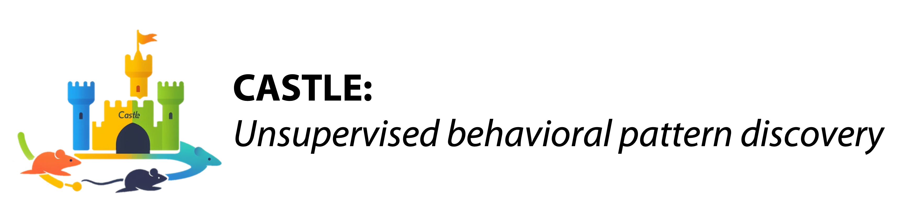
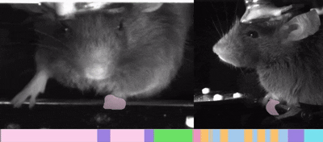
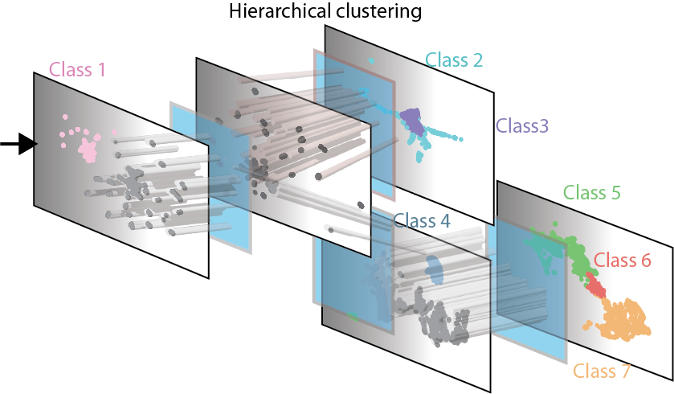

[](https://arxiv.org/abs/<INDEX>)
[](https://badge.fury.io/py/castle-ai)
[](https://colab.research.google.com/github/CASTLE-ai/castle-ai/blob/main/notebooks/colab.ipynb)
[](LICENSE)


[](https://pepy.tech/projects/castle-ai)
[](https://pepy.tech/projects/castle-ai)


**CASTLE (Combined Approach for Segmentation and Tracking with Latent Extraction)** is a training-free framework that combines segmentation models, tracking algorithms, and visual foundation models to automatically discover animal behaviors from video. Through focused latent extraction and hierarchical clustering, it achieves expert-level accuracy across multiple species without manual labeling, while uncovering previously hidden behavioral patterns that keypoint methods miss.

<p align="center">
  
</p>

## Latest updates
- 2025-08: Improved core efficiency.
- 2024-09: Public release of this tool.

## Installation

```bash
pip install castle-ai
```

## Quick Start

### Web Interface
```bash
castle-ai # open the web interface (default port: 7860)

# or

castle-ai --video <path_to_video> # analyze a single video
```

### Python API

#### Quick Start - Minimal Example (Already have ROI prompts and explored classifier)
which is earlier created by Web Interface

```python
import castle

# Initialize analyzer with videos
analyzer = castle.Analyzer()
analyzer.add_videos(['video1.mp4', 'video2.mp4'])

# 1. Import ROI prompts
analyzer.add_roi(dir_path='roi_prompt/') 
                  
# 2. Video Segmentation & Tracking
analyzer.track_video_object()

# 3. Focused Latent Extraction
features = analyzer.generate_focused_visual_latent(
  neutralize_orientation=True, 
  config='explored_classifier_preprocess_config.yaml') 

# 4. Apply Behavioral Classification
classifier = castle.Classifier(path='explored_classifier.pkl') 
classifier.sort(features)
syllables, metadata = classifier.get_results()

# 5. Save Results
classifier.generate_subtitles() # (optional) generate subtitles for each video
classifier.save_results()
```

#### Example for creating ***ROI prompts***
```python
import castle

analyzer = castle.Analyzer()
analyzer.add_videos(['video1.mp4', 'video2.mp4'])
img = analyzer.get_image() # get seed frame
click_list = [[<x1>, <y1>, <click_type>], 
              [<x2>, <y2>, <click_type>], 
              ...] 
              # include "plus click" or "minus click"
roi = analyzer.predict_ROI(img, click_list)

analyzer.save_roi_prompt(dir_path='roi_prompt/') 

```
#### Example for creating ***Hierarchical Behavioral Classification***
```python
import castle

classifier = castle.Classifier(
  video_list=['video1.mp4', 'video2.mp4'], 
  latent_list=['video1_features.npy', 'video2_features.npy'], 
  num_temporal_concatenation=5) 


# ---Hierarchical Behavioral Classification---
embedding_umap, cluster_ids = classifier.exploring_node(
  node_id=0, split_strength=3) 
  # split_strength 0-10, 
  # 0 is no split, 10 is the least sensitive to split
classifier.create_nodes(
  class_id_set=[('0', 'class1'), ('2', 'class2')]) 
  # create nodes for each class

# Repeat this step until the desired behavior classes are found.
# --------------------------------


classifier.save_classifier() # save the classifier to file
```
<p align="center">

</p>

## About us

CASTLE is a project by the [Wu Lab](https://www.yuweiwu.org/), a research group at the [Academia Sinica](https://www.sinica.edu.tw/en).


## Credits & Licenses

This project incorporates code and methodologies from the following sources:

- SAM (Segment Anything Model): https://github.com/facebookresearch/segment-anything
- DeAOT (Decoupling Features in Hierarchical Propagation): https://github.com/yoxu515/aot-benchmark
- DINOv2 (Self-Supervised Vision Transformer): https://github.com/facebookresearch/dinov2

This work is distributed under the terms of the Apache License 2.0.


## Citation

If you find this work useful, please consider citing:

```bibtex
@article{CASTLE,
  title={CASTLE: a training‑free foundation‑model pipeline for unsupervised, cross‑species behavioral classification},
  author={Liu, Yu-Shun and Yeh, Han-Yuan and Hu, Yu-Ting and Wu, Bing-Shiuan and Chen, Yi-Fang and Yang, Jia-Bin and Jasmin, Sureka and Hsu, Ching-Lung and Lin, Suewei and Chen, Chun-Hao and Wu, Yu-Wei},
  journal={TBD},
  year={2025}
}
```